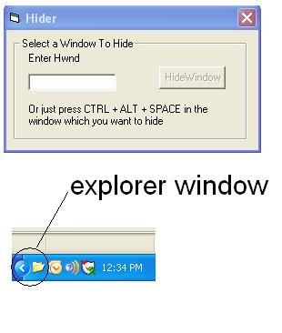



## Hider \(A tool which hides unnecessary windows\)

### Description

This little utility hides all the unnecessary window and displays them in the taskbar

Just press Ctrl+Alt+Space in the window which is to be hidden, it hides them and makes

your desktop free of clumsy windows. All you have to do is to double click the taskbar

icon to show the windows.

And it can even hide itself!!

But like all other programs which make use of SubClassing, take care while running it from within the IDE. Hope You will enjoy it!!
 
### More Info
 

             |
---                |---
**Submitted On**   |2011-05-19 18:21:14
**By**             |[Pravesh Koirala](https://github.com/Planet-Source-Code/PSCIndex/blob/master/ByAuthor/pravesh-koirala.md)
**Level**          |Intermediate
**User Rating**    |5.0 (20 globes from 4 users)
**Compatibility**  |VB 6\.0
**Category**       |[Windows API Call/ Explanation](https://github.com/Planet-Source-Code/PSCIndex/blob/master/ByCategory/windows-api-call-explanation__1-39.md)
**World**          |[Visual Basic](https://github.com/Planet-Source-Code/PSCIndex/blob/master/ByWorld/visual-basic.md)
**Archive File**   |[Hider\_\(A\_t2204585202011\.zip](https://github.com/Planet-Source-Code/pravesh-koirala-hider-a-tool-which-hides-unnecessary-windows__1-73920/archive/master.zip)

